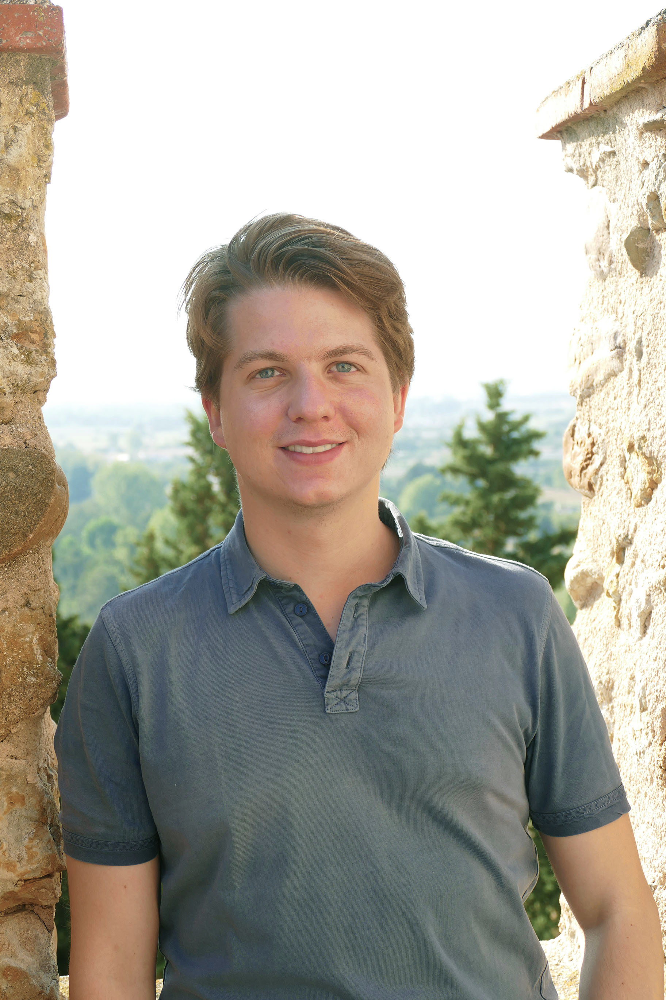

Machine learning PhD student in Jürgen Schmidhuber's group at IDSIA & USI.
My current research interest lies mainly in artificial creativity, curiosity, critical rationalism and open-endedness.
I am also a classical pianist and composer.

**Recent News:**
- 2020: Started my PhD at the [Swiss AI Lab IDSIA](https://www.idsia.ch) (Lugano) in [Jürgen Schmidhuber](https://people.idsia.ch//~juergen/)'s group
- 2020: Finished Master's degree in Music Informatics at the University of Music Karlsruhe
- 2020: Master's thesis "Generative Transformer-based Models of Symbolic Polyphonic Music" [(pdf)](/assets/pdfs/mami_thesis.pdf) at the [Bosch Center for Artificial Intelligence](https://www.bosch-ai.com)
- 2019: My project ["Immersions - How Does Music Sound to Artificial Ears?"](/blog/immersions) has won the Outstanding Demonstration award at [NeurIPS 2019](https://nips.cc/Conferences/2019/) in Vancouver
- 2019: Finished my Master's degree in piano performance with distinction under Prof. Michael Hauber at the University of Music and Performing Arts Stuttgart

[Academic CV](../assets/pdfs/cv_2021.pdf)
