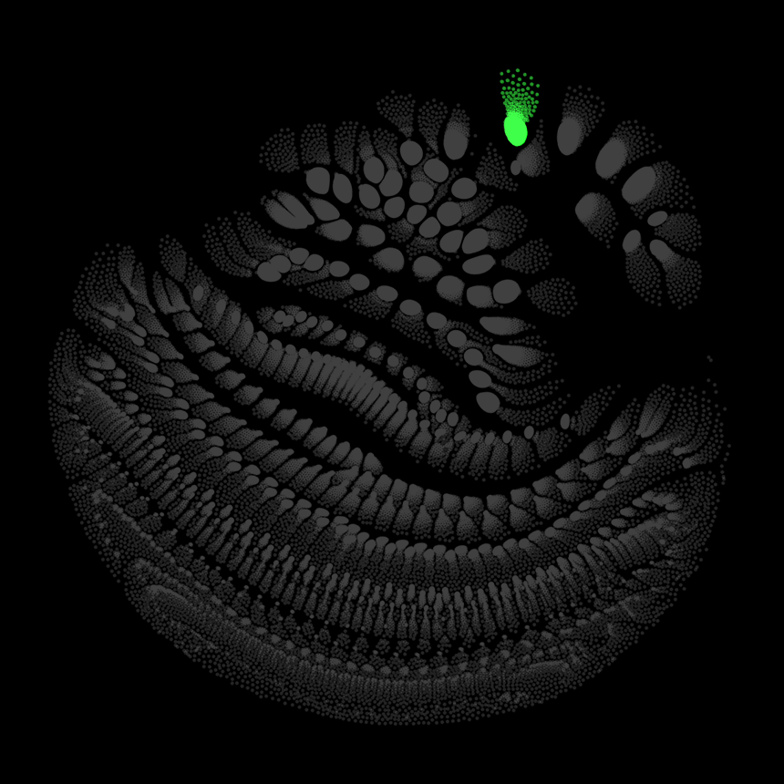
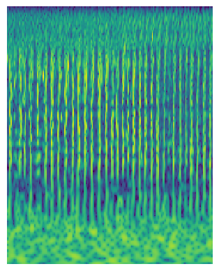

# Immersions
## Visualizing and sonifying how an artificial ear hears music

Immersions is a system that lets us interact with and explore an audio processing neural network, or what I call an "artificial ear".
There are two main aspects of this project - one is visual, the other is sonic.
For the visualization, first the neurons of the network are laid out in 2D, then their activation is shown at every moment, depending on the input.
To make audible how music sound to the artificial ear an optimization procedure generates sounds that that specifically activate certain neurons in the network.
For more informations, please the the paper or the poster, as well as the visualization code (that you could use to visualize your own networks)!

[Paper](https://neurips2019creativity.github.io/doc/Immersions_NeurIPS.pdf)

[Poster](/assets/pdfs/Immersions_Poster.pdf)

[Neural layout & visualization code](https://github.com/vincentherrmann/neural-layout)







  

    
  

  

    
  

<audio controls>
  <source src="../assets/audio/immersions/house_3_ar_block_1_ch_0_1_from_low_noise.mp3" type="audio/mp3">
</audio>

<audio controls>
  <source src="../assets/audio/immersions/house_3_scalogram.mp3" type="audio/mp3">
</audio>

<audio controls>
  <source src="../assets/audio/immersions/house_3_encoder_block_0_conv_1_ch_0_1_from_low_noise.mp3" type="audio/mp3">
</audio>

## Finding the layout of the neural network
### Immersions model architecture


### VGG 16 architecture


### ResNet 18 architecture


## Other visualizations

### Network connections


### Network nodes


### Live activations


## Input optimization examples
### Original input


### Optimized input for selected neurons


### Full view of optimized input


### GUI

